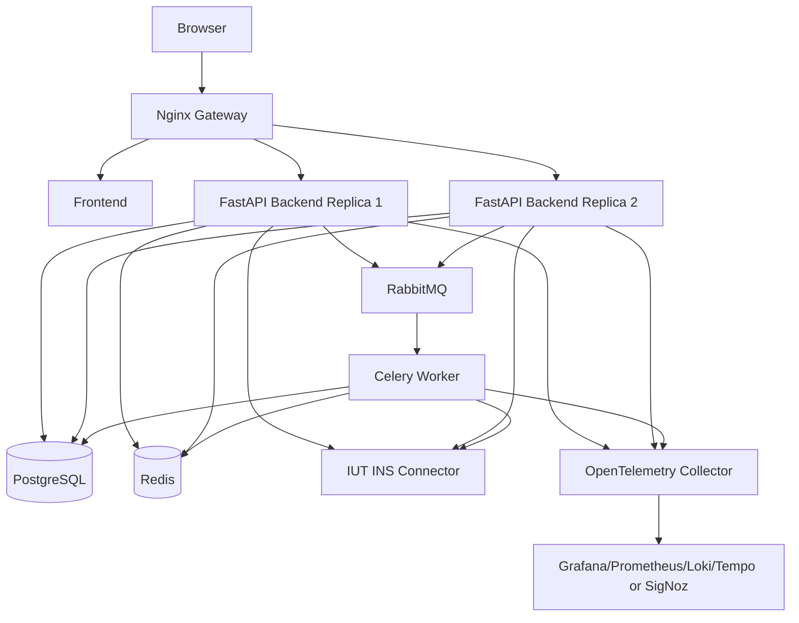
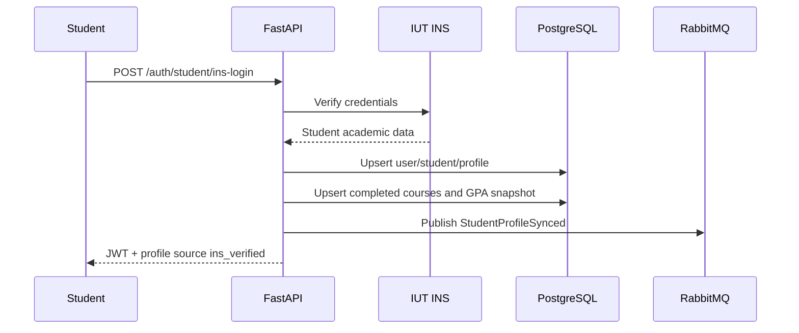
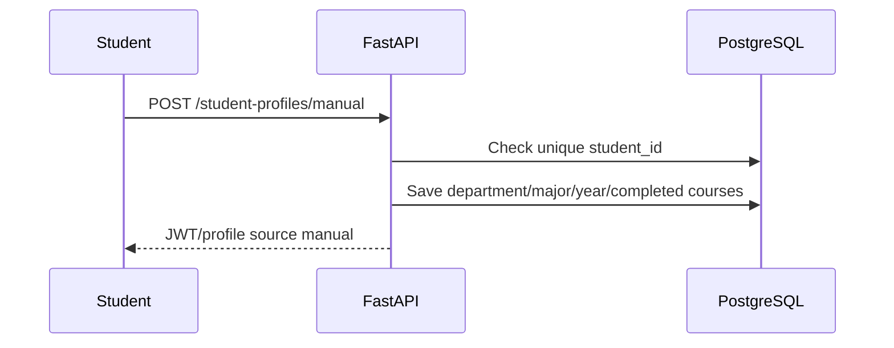
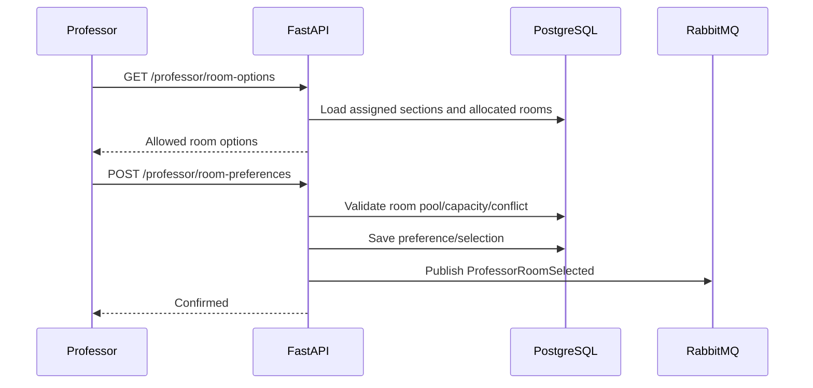
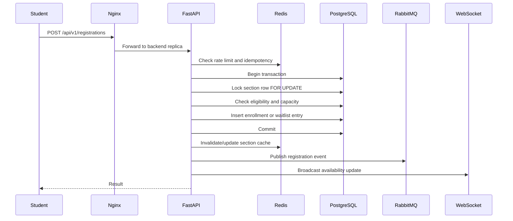

# 02 — Architecture

## 1. Architecture style

CRSP uses a **Dockerized modular monolith with supporting services**.

This is the best fit because:

- the business logic is tightly connected;
- consistency matters more than independent microservice deployment;
- the team has limited time;
- the project still needs multi-service orchestration;
- backend replicas, workers, Redis, RabbitMQ, and observability services satisfy distributed-system requirements.

## 2. High-level architecture



## 3. Data ownership

| Data | Source of truth |
|---|---|
| CRSP users | PostgreSQL |
| Student ID uniqueness | PostgreSQL |
| INS-verified academic data | INS, cached/snapshotted in PostgreSQL |
| Manual academic data | PostgreSQL, marked unverified |
| Course offerings | PostgreSQL |
| Rooms/time slots | PostgreSQL |
| Registration/enrollment | PostgreSQL |
| Waitlist | PostgreSQL |
| Temporary idempotency/rate-limit/cache | Redis |
| Live update pub/sub | Redis |
| Background event transport | RabbitMQ |

## 4. Main backend modules

```text
backend/app/
├─ main.py
├─ api/v1/
│  ├─ auth.py
│  ├─ student_profiles.py
│  ├─ professors.py
│  ├─ admin.py
│  ├─ courses.py
│  ├─ rooms.py
│  ├─ scheduling.py
│  ├─ registrations.py
│  ├─ waitlists.py
│  └─ websocket.py
├─ core/
│  ├─ config.py
│  ├─ security.py
│  ├─ exceptions.py
│  ├─ logging.py
│  └─ telemetry.py
├─ db/
│  ├─ base.py
│  ├─ session.py
│  └─ transaction.py
├─ modules/
│  ├─ auth/
│  ├─ student_profiles/
│  ├─ ins_integration/
│  ├─ professors/
│  ├─ courses/
│  ├─ rooms/
│  ├─ scheduling/
│  ├─ registration/
│  ├─ waitlist/
│  ├─ notifications/
│  └─ audit/
├─ integrations/
│  ├─ redis_client.py
│  ├─ rabbitmq.py
│  ├─ ins_client.py
│  └─ websocket_manager.py
└─ system_components/
   └─ token_bucket/
```

## 5. Request flows

### 5.1 INS-verified student onboarding



### 5.2 Manual student onboarding



### 5.3 Professor room choice



### 5.4 Registration



## 6. Project structure

```text
crsp-platform/
├─ docker-compose.yml
├─ .env.example
├─ README.md
├─ CHANGELOG.md
├─ docs/
├─ backend/
├─ frontend/
├─ worker/
├─ nginx/
├─ postgres/
└─ observability/
```

## 7. Architecture decisions

### ADR-001: Modular monolith

Use a modular monolith instead of microservices to avoid unnecessary distributed transactions while still supporting multiple replicas and workers.

### ADR-002: PostgreSQL as registration source of truth

Registration state is transactional. PostgreSQL provides constraints, row locks, and reliable writes.

### ADR-003: Redis is non-authoritative

Redis improves speed but cannot decide final enrollment.

### ADR-004: INS is optional for student flow

INS verification increases realism, but manual profile fallback protects the demo from external dependency risk.

### ADR-005: GPA skipped for manual profiles

Manual GPA is not trusted and should not affect eligibility.
