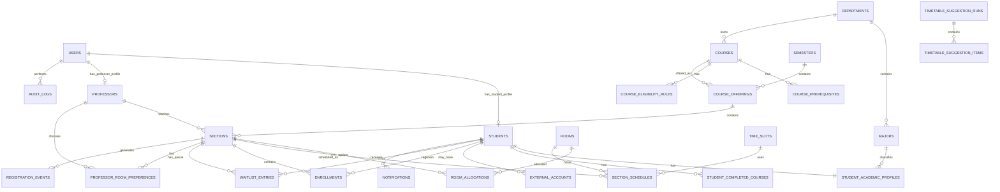

# 03 — Data Model

## 1. Data modeling principles

- PostgreSQL is the source of truth for CRSP domain state.
- INS data is stored as a local snapshot, not treated as manually editable trusted data.
- Manual-profile data is stored separately or marked with `profile_source = manual`.
- Student ID is unique across all students.
- Eligibility rules must be explainable and auditable.
- Registration consistency is protected by constraints and transactions.

## 2. ER diagram draft



## 3. Core tables

### 3.1 `users`

```sql
CREATE TABLE users (
    id BIGSERIAL PRIMARY KEY,
    email VARCHAR(255) UNIQUE,
    password_hash TEXT,
    role VARCHAR(30) NOT NULL CHECK (role IN ('admin', 'professor', 'student')),
    status VARCHAR(30) NOT NULL DEFAULT 'active',
    created_at TIMESTAMPTZ NOT NULL DEFAULT now(),
    updated_at TIMESTAMPTZ NOT NULL DEFAULT now()
);
```

### 3.2 `students`

```sql
CREATE TABLE students (
    id BIGSERIAL PRIMARY KEY,
    user_id BIGINT UNIQUE REFERENCES users(id),
    student_number VARCHAR(40) NOT NULL UNIQUE,
    full_name VARCHAR(255) NOT NULL,
    profile_source VARCHAR(30) NOT NULL CHECK (profile_source IN ('ins_verified', 'manual')),
    created_at TIMESTAMPTZ NOT NULL DEFAULT now(),
    updated_at TIMESTAMPTZ NOT NULL DEFAULT now()
);
```

### 3.3 `student_academic_profiles`

```sql
CREATE TABLE student_academic_profiles (
    id BIGSERIAL PRIMARY KEY,
    student_id BIGINT NOT NULL UNIQUE REFERENCES students(id),
    department_id BIGINT REFERENCES departments(id),
    major_id BIGINT REFERENCES majors(id),
    academic_year INT CHECK (academic_year BETWEEN 1 AND 6),
    group_name VARCHAR(80),
    current_gpa NUMERIC(3,2),
    gpa_is_verified BOOLEAN NOT NULL DEFAULT false,
    academic_status VARCHAR(40),
    last_synced_at TIMESTAMPTZ,
    created_at TIMESTAMPTZ NOT NULL DEFAULT now(),
    updated_at TIMESTAMPTZ NOT NULL DEFAULT now(),

    CONSTRAINT manual_gpa_not_verified CHECK (
        gpa_is_verified = false OR current_gpa IS NOT NULL
    )
);
```

Policy:

- INS profile: `gpa_is_verified = true` if GPA is received from INS.
- Manual profile: `gpa_is_verified = false`; GPA is ignored.

### 3.4 `student_completed_courses`

```sql
CREATE TABLE student_completed_courses (
    id BIGSERIAL PRIMARY KEY,
    student_id BIGINT NOT NULL REFERENCES students(id),
    course_id BIGINT REFERENCES courses(id),
    course_code VARCHAR(40) NOT NULL,
    course_title VARCHAR(255),
    grade VARCHAR(10),
    credits INT,
    source VARCHAR(30) NOT NULL CHECK (source IN ('ins_verified', 'manual')),
    completed_semester VARCHAR(40),
    created_at TIMESTAMPTZ NOT NULL DEFAULT now(),
    UNIQUE(student_id, course_code)
);
```

### 3.5 `external_accounts`

```sql
CREATE TABLE external_accounts (
    id BIGSERIAL PRIMARY KEY,
    student_id BIGINT NOT NULL REFERENCES students(id),
    provider VARCHAR(40) NOT NULL,
    external_user_id VARCHAR(120),
    last_verified_at TIMESTAMPTZ,
    metadata JSONB,
    created_at TIMESTAMPTZ NOT NULL DEFAULT now(),
    UNIQUE(provider, external_user_id)
);
```

### 3.6 `courses`

```sql
CREATE TABLE courses (
    id BIGSERIAL PRIMARY KEY,
    department_id BIGINT REFERENCES departments(id),
    code VARCHAR(40) NOT NULL UNIQUE,
    title VARCHAR(255) NOT NULL,
    credits INT NOT NULL CHECK (credits > 0),
    description TEXT,
    course_type VARCHAR(40),
    is_repeatable BOOLEAN NOT NULL DEFAULT false,
    created_at TIMESTAMPTZ NOT NULL DEFAULT now()
);
```

### 3.7 `course_prerequisites`

```sql
CREATE TABLE course_prerequisites (
    id BIGSERIAL PRIMARY KEY,
    course_id BIGINT NOT NULL REFERENCES courses(id),
    prerequisite_course_id BIGINT NOT NULL REFERENCES courses(id),
    rule_group VARCHAR(40) DEFAULT 'all',
    created_at TIMESTAMPTZ NOT NULL DEFAULT now(),
    UNIQUE(course_id, prerequisite_course_id)
);
```

### 3.8 `course_eligibility_rules`

```sql
CREATE TABLE course_eligibility_rules (
    id BIGSERIAL PRIMARY KEY,
    course_id BIGINT NOT NULL REFERENCES courses(id),
    min_academic_year INT,
    min_gpa NUMERIC(3,2),
    allowed_department_ids BIGINT[],
    allowed_major_ids BIGINT[],
    rule_metadata JSONB,
    created_at TIMESTAMPTZ NOT NULL DEFAULT now()
);
```

GPA rule behavior:

- If `min_gpa` is set and student is `ins_verified`, compare verified GPA.
- If `min_gpa` is set and student is `manual`, skip GPA and record reason `gpa_rule_skipped_manual_profile`.

### 3.9 `rooms`

```sql
CREATE TABLE rooms (
    id BIGSERIAL PRIMARY KEY,
    building VARCHAR(80),
    room_number VARCHAR(40) NOT NULL,
    capacity INT NOT NULL CHECK (capacity > 0),
    room_type VARCHAR(40) NOT NULL DEFAULT 'lecture',
    is_active BOOLEAN NOT NULL DEFAULT true,
    UNIQUE(building, room_number)
);
```

### 3.10 `sections`

```sql
CREATE TABLE sections (
    id BIGSERIAL PRIMARY KEY,
    course_offering_id BIGINT NOT NULL REFERENCES course_offerings(id),
    professor_id BIGINT REFERENCES professors(id),
    section_code VARCHAR(40) NOT NULL,
    capacity INT NOT NULL CHECK (capacity > 0),
    room_selection_mode VARCHAR(40) NOT NULL DEFAULT 'admin_fixed',
    status VARCHAR(30) NOT NULL DEFAULT 'draft',
    created_at TIMESTAMPTZ NOT NULL DEFAULT now(),
    updated_at TIMESTAMPTZ NOT NULL DEFAULT now(),
    UNIQUE(course_offering_id, section_code)
);
```

### 3.11 `room_allocations`

```sql
CREATE TABLE room_allocations (
    id BIGSERIAL PRIMARY KEY,
    section_id BIGINT NOT NULL REFERENCES sections(id),
    room_id BIGINT NOT NULL REFERENCES rooms(id),
    allocated_by_user_id BIGINT REFERENCES users(id),
    is_preferred BOOLEAN NOT NULL DEFAULT false,
    created_at TIMESTAMPTZ NOT NULL DEFAULT now(),
    UNIQUE(section_id, room_id)
);
```

### 3.12 `professor_room_preferences`

```sql
CREATE TABLE professor_room_preferences (
    id BIGSERIAL PRIMARY KEY,
    section_id BIGINT NOT NULL REFERENCES sections(id),
    professor_id BIGINT NOT NULL REFERENCES professors(id),
    room_id BIGINT NOT NULL REFERENCES rooms(id),
    preference_rank INT NOT NULL DEFAULT 1,
    status VARCHAR(30) NOT NULL DEFAULT 'selected',
    created_at TIMESTAMPTZ NOT NULL DEFAULT now(),
    UNIQUE(section_id, professor_id, room_id)
);
```

### 3.13 `enrollments`

```sql
CREATE TABLE enrollments (
    id BIGSERIAL PRIMARY KEY,
    student_id BIGINT NOT NULL REFERENCES students(id),
    section_id BIGINT NOT NULL REFERENCES sections(id),
    course_id BIGINT NOT NULL REFERENCES courses(id),
    semester_id BIGINT NOT NULL REFERENCES semesters(id),
    status VARCHAR(30) NOT NULL DEFAULT 'enrolled',
    idempotency_key VARCHAR(120),
    enrolled_at TIMESTAMPTZ NOT NULL DEFAULT now(),
    dropped_at TIMESTAMPTZ,
    UNIQUE(student_id, section_id),
    UNIQUE(student_id, course_id, semester_id)
);
```

### 3.14 `waitlist_entries`

```sql
CREATE TABLE waitlist_entries (
    id BIGSERIAL PRIMARY KEY,
    student_id BIGINT NOT NULL REFERENCES students(id),
    section_id BIGINT NOT NULL REFERENCES sections(id),
    position INT NOT NULL,
    status VARCHAR(30) NOT NULL DEFAULT 'waiting',
    created_at TIMESTAMPTZ NOT NULL DEFAULT now(),
    promoted_at TIMESTAMPTZ,
    UNIQUE(student_id, section_id),
    UNIQUE(section_id, position)
);
```

## 4. Indexes

```sql
CREATE INDEX idx_students_student_number ON students(student_number);
CREATE INDEX idx_profiles_department_major ON student_academic_profiles(department_id, major_id);
CREATE INDEX idx_completed_courses_student_code ON student_completed_courses(student_id, course_code);
CREATE INDEX idx_courses_code ON courses(code);
CREATE INDEX idx_sections_offering_status ON sections(course_offering_id, status);
CREATE INDEX idx_room_allocations_section ON room_allocations(section_id);
CREATE INDEX idx_prof_room_pref_section ON professor_room_preferences(section_id);
CREATE INDEX idx_schedules_section ON section_schedules(section_id);
CREATE INDEX idx_enrollments_student_semester ON enrollments(student_id, semester_id);
CREATE INDEX idx_enrollments_section_status ON enrollments(section_id, status);
CREATE INDEX idx_waitlist_section_status_position ON waitlist_entries(section_id, status, position);
CREATE INDEX idx_audit_logs_actor_time ON audit_logs(actor_user_id, created_at DESC);
```

## 5. Open decisions

1. Should manual completed courses require admin approval, or trust student input for demo?
2. Should professor room choice be one final selection or ranked preferences?
3. Should eligibility rules be normalized further or stored partly as JSONB?
4. Should repeated courses be allowed if grade is below threshold?
