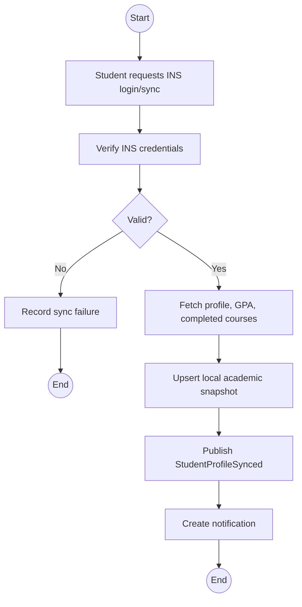
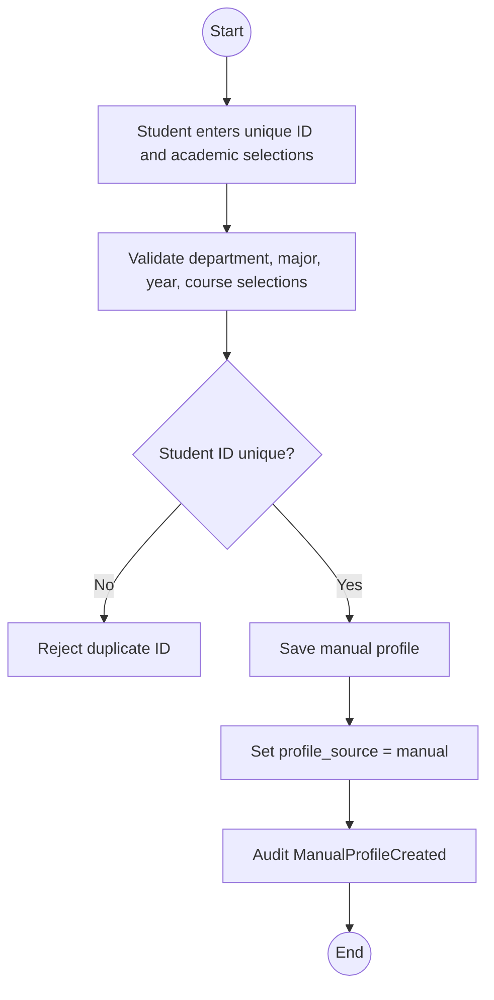
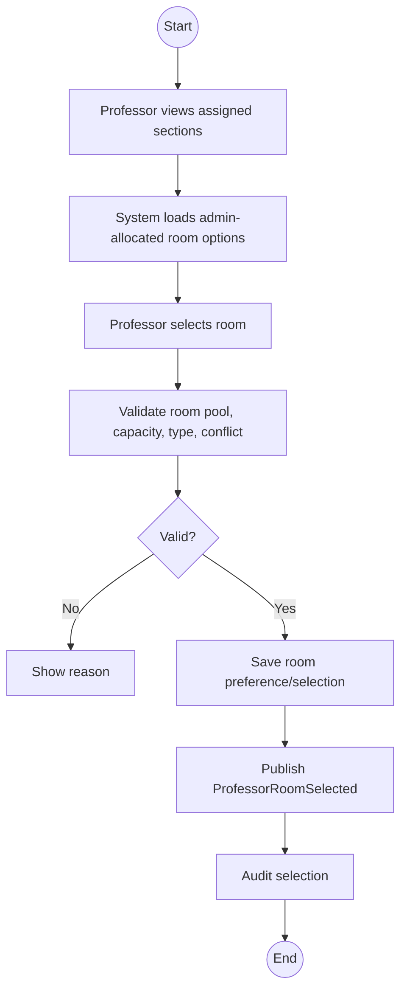
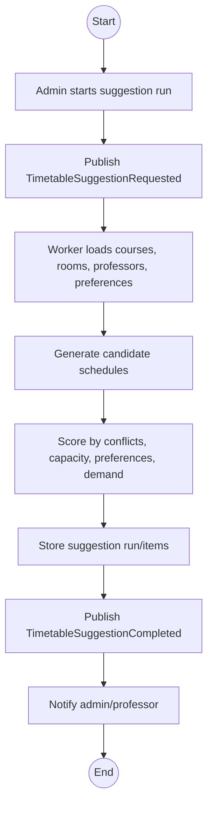
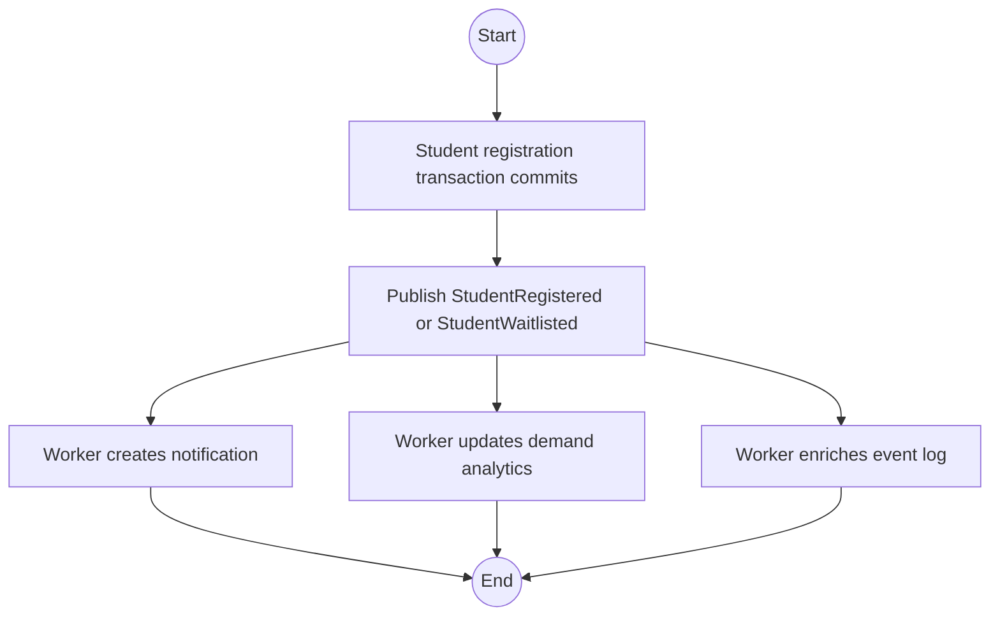
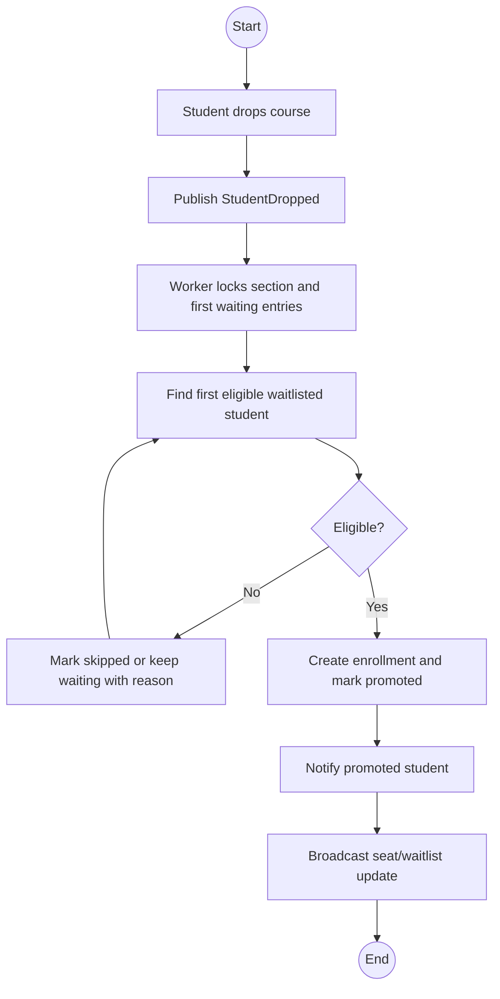

# 07 — Pipeline and BPMN

## 1. Pipeline technology

CRSP uses:

- RabbitMQ as message broker;
- Celery as background worker;
- PostgreSQL for durable results;
- Redis for temporary status/cache.

## 2. Event types

```text
StudentProfileSynced
ManualProfileCreated
ProfessorRoomSelected
TimetableSuggestionRequested
TimetableSuggestionCompleted
StudentRegistered
StudentWaitlisted
StudentDropped
WaitlistPromoted
RegistrationFailed
SectionAvailabilityChanged
```

## 3. Workflow A — INS profile sync

Purpose:

Sync trusted academic data after INS login or manual refresh.

BPMN-style flow:



Implementation notes:

- Do not store raw INS password.
- Store `last_synced_at`.
- Mark profile source as `ins_verified`.
- If INS is unavailable, user can use manual profile path.

## 4. Workflow B — Manual profile creation

Purpose:

Allow student to skip INS and still use realistic registration flow.



Important rule:

- GPA is not considered for manual-profile students.

## 5. Workflow C — Professor room selection

Purpose:

Let professors choose rooms from admin-approved options.



## 6. Workflow D — Timetable suggestion

Purpose:

Generate best-fit timetable options.



MVP algorithm:

```text
score =
  room_capacity_fit
  + professor_preference_match
  + required_course_group_fit
  - room_conflict_penalty
  - professor_conflict_penalty
  - student_group_conflict_penalty
```

## 7. Workflow E — Registration event pipeline

Purpose:

Move non-critical registration work out of the request path.



Critical rule:

> The actual enrollment must be committed before background tasks run.

## 8. Workflow F — Waitlist promotion

Purpose:

Promote or notify next student after a drop.



Recommended MVP:

- Automatic promotion.
- Re-check eligibility before promotion.
- If first student is no longer eligible, continue to next student.

## 9. Outbox option

For stronger reliability, CRSP can implement transactional outbox:

1. Registration transaction writes enrollment.
2. Same transaction writes event row to `registration_events`.
3. Worker reads unsent events and publishes to RabbitMQ.
4. Event status becomes `published`.

MVP can publish directly after commit, but outbox is better for the report if time permits.

## 10. Required screenshots

- RabbitMQ queue with messages.
- Worker logs processing an event.
- Notification created after registration.
- Timetable suggestion run completed.
- Waitlist promotion result.
